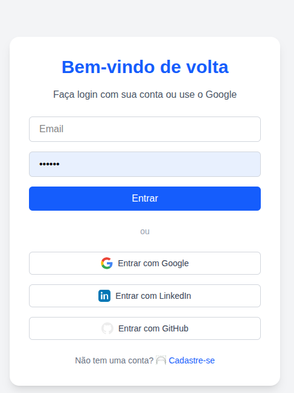
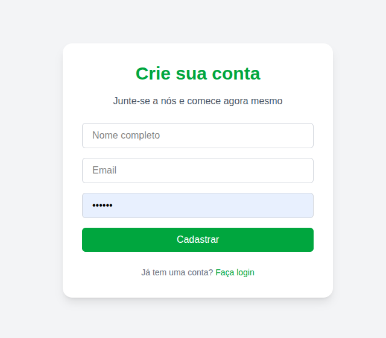

# 🧠 Login Frontend com Next.js + Google Auth + TailwindCSS

Este projeto é uma interface moderna de login e cadastro desenvolvida com **Next.js**, **TailwindCSS** e suporte à **autenticação social via Google**.

---

## 🚀 Tecnologias Utilizadas

- [Next.js 15+](https://nextjs.org/)
- [TailwindCSS](https://tailwindcss.com/)
- [TypeScript](https://www.typescriptlang.org/)
- Autenticação manual (email/senha)
- Login com Google (via OAuth 2.0)

---

## 📁 Estrutura de Pastas

```bash
├── README.md
├── src
│   └── app
│       ├── dashboard
│       │   └── page.tsx
│       ├── favicon.ico
│       ├── globals.css
│       ├── google-success
│       │   └── page.tsx
│       ├── layout.tsx
│       ├── login
│       │   └── page.tsx
│       ├── page.tsx
│       └── register
│           └── page.tsx
└── tsconfig.json
```


---

## 🔧 Configuração

### 1. Clonar o projeto

```bash
git clone https://github.com/seu-usuario/google-page.git
cd google-page
```

1. Instalar as dependências:

```bash
npm install
# ou
yarn install
```

2. Executar localmente:

```bash
npm run dev
```

O app ficará disponível em:
👉 http://localhost:3001 (ajustável via PORT)

---

🔐 Autenticação
🔸 Login Manual
- Rota: POST http://localhost:3000/auth/login
- Campos: email, password
- Token armazenado no localStorage
- Redireciona para /dashboard ao logar com sucesso

🔸 Login com Google
- Botão redireciona para: http://localhost:3000/auth/google
- Backend NestJS cuida da autenticação via Google

🔐 Usuário é redirecionado para:
- http://localhost:3001/google-success?token=JWT_AQUI
- O frontend captura o token da URL e o salva no localStorage


---

📸 Telas
- Login



- Cadastro



⚙️ Próximos Passos
🔒 Proteção de rotas com middleware.ts

📦 Integração com API protegida usando Authorization: Bearer

🌍 Deploy no Vercel

🧑‍💻 Desenvolvido por
- Reinaldo Pereira dos Santos
- Engenheiro de Software Fullstack

📧 reinaldoper83@gmail.com